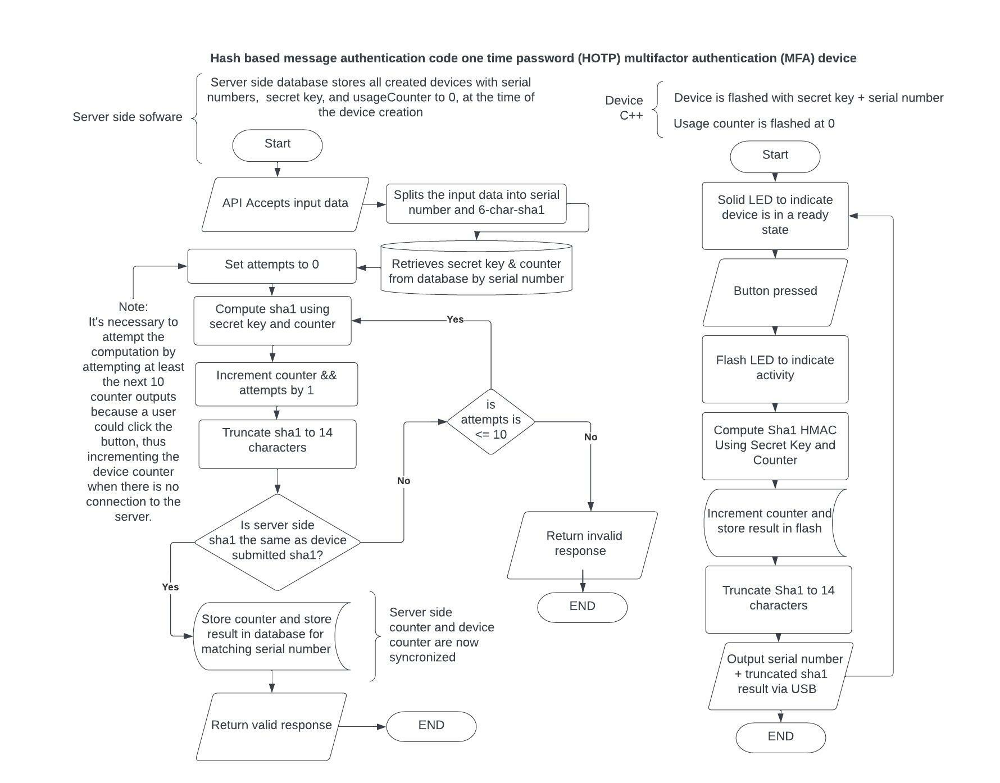

#Picokey

For this project I wanted to recreate a two-factor authentication token similar to a Yubikey.
The device uses an HMAC based one time password. 

I used a Pimoroni Tiny 2040 microcontroller as the device. Since the controller doesn't have
an EEPROM I had to store the persistent data in flash memory. I wasn't able to get USB output
working by the due date, so for now it prints the output over serial and the output must then be
input into the "server side" program. The "server" uses SQLITE3 to store the secret key, current count 
and device ID.

###Flowchart

